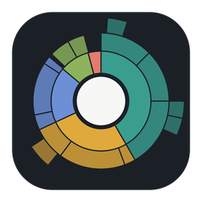
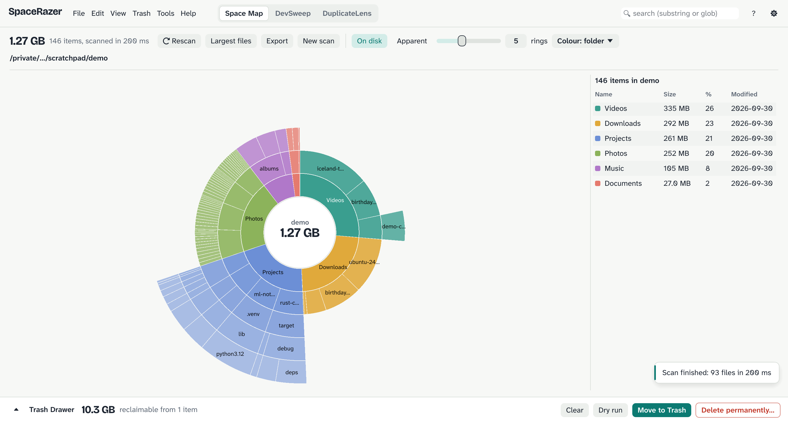
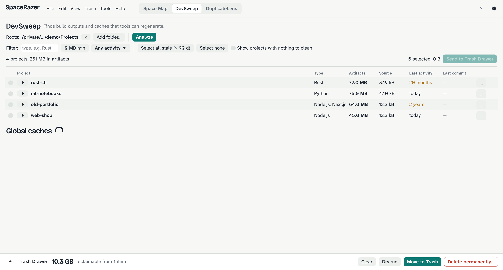
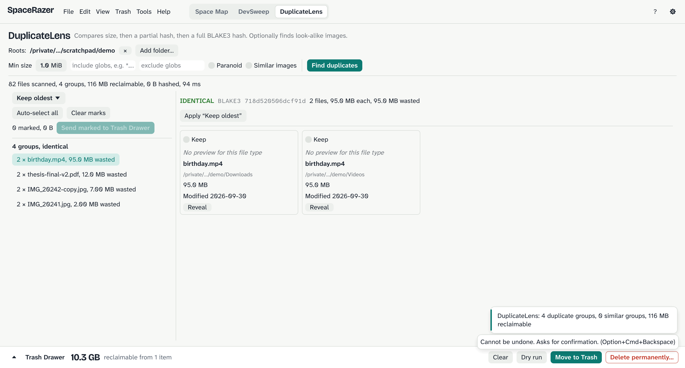

<p align="center">
  
</p>

<h1 align="center">SpaceRazer</h1>

<p align="center">
  See what fills your disk, then reclaim space safely.<br>
  A fast, native disk analyser for macOS, Windows and Linux.
</p>

<p align="center">
  <a href="https://github.com/theArjun/spacerazer/releases/latest"></a>
  <a href="https://github.com/theArjun/spacerazer/actions/workflows/ci.yml"></a>
  <a href="#license"></a>
</p>



## What it does

SpaceRazer is one app with three tools that share a single scanner and a
single, careful way of deleting things.

**Space Map** draws your disk as an interactive sunburst. Each ring is a
folder level and each arc's angle is its size. Hover for details, click to
zoom in, and use the synchronized list, breadcrumbs, search and "largest
files" view to find what matters. A million files scan in a few seconds.

**DevSweep** finds regenerable developer build output and caches:
`node_modules`, `target/`, `.next/`, virtual environments, Gradle and Xcode
data, package-manager caches and more. It only flags a folder when the
matching project file is next to it, so a random `build/` folder is never
touched. Each item is tagged Safe, Caution or Review, shows how to regenerate
it, and projects untouched for months are easy to select in bulk.



**DuplicateLens** finds identical files by comparing size, then a partial
hash, then a full BLAKE3 hash, with an optional byte-by-byte check. It can
also group visually similar images. Hard links are recognised, auto-select
rules always keep one copy, and duplicates can be replaced with clones or
hard links instead of deleted.



## Nothing is deleted by surprise

Every tool sends items to the **Trash Drawer** first. From there you can:

- **Dry run** to see exactly what would happen, with no changes made.
- **Move to Trash**, the default, which is recoverable. On disks without a
  system trash, items go to a quarantine folder you can restore from.
- **Delete permanently**, which asks for confirmation and, above a size you
  choose, for you to type `DELETE`.

Just before anything is removed, SpaceRazer checks it again. Items that
changed since you staged them are skipped. Symbolic links are never followed,
system folders and your home folder are protected, and every change is written
to an operation journal you can review.

## Install

Download the latest build for your system from
[Releases](https://github.com/theArjun/spacerazer/releases/latest).

| System | Download | Notes |
| --- | --- | --- |
| macOS 13+ (Apple silicon and Intel) | `SpaceRazer-<version>-macos-universal.dmg` | Drag SpaceRazer to Applications. If the build is not notarized, right-click the app and choose Open the first time. |
| Windows 10/11 (x86_64) | `spacerazer-<version>-windows-x86_64.zip` | Unzip and run `spacerazer.exe`. SmartScreen may ask you to confirm the first launch. |
| Debian / Ubuntu | `spacerazer_<version>_amd64.deb` or `_arm64.deb` | `sudo apt install ./spacerazer_*.deb` |
| Other Linux | `spacerazer-<version>-linux-<arch>.tar.gz` | Unpack and run `./spacerazer`. |

Each release includes `SHA256SUMS.txt` for verifying downloads.

On macOS, some folders (Mail, Messages, Safari) can only be measured after you
grant SpaceRazer **Full Disk Access** in System Settings › Privacy & Security.

## Use it

Open the app and pick a disk or folder, or drop a folder onto the window.
Every command is in the menu bar with its keyboard shortcut; press <kbd>?</kbd>
to see them all.

The same features are available from the command line, for scripts and
servers:

```sh
spacerazer-cli scan ~ --depth 2 --largest 20     # size summary
spacerazer-cli scan ~/Projects --json > sizes.json
spacerazer-cli dev ~/Projects --stale-days 90     # stale build artifacts
spacerazer-cli dup ~/Pictures --min-size 1000000  # duplicate files
spacerazer-cli delete ~/Downloads/old.iso         # dry run
spacerazer-cli delete ~/Downloads/old.iso --yes   # move to trash
spacerazer-cli journal                            # what was changed
```

On macOS and Linux the app binary also accepts these subcommands
(`spacerazer scan …`).

Settings are stored as TOML in your platform's config folder and can be
edited in the app (<kbd>Cmd/Ctrl</kbd>+<kbd>,</kbd>).

## Build from source

You need [Rust](https://rustup.rs) 1.85 or newer. On Linux, also install the
windowing libraries:

```sh
sudo apt install libxkbcommon-dev libwayland-dev libxcb-render0-dev \
  libxcb-shape0-dev libxcb-xfixes0-dev libgl1-mesa-dev
```

Then:

```sh
git clone https://github.com/theArjun/spacerazer
cd spacerazer
make run               # optimised build, then launch
make run DIR=~/code    # open straight into a scan
make test              # all tests
make lint              # rustfmt and clippy, as CI runs them
make help              # every target
```

## How it's built

SpaceRazer is written in Rust with [egui](https://github.com/emilk/egui). The
code is a Cargo workspace in which only `sr-gui` depends on the GUI:

| Crate | Responsibility |
| --- | --- |
| `sr-core` | Arena file tree, name interning, size aggregation |
| `sr-platform` | Per-OS details: file identity, allocated size, bulk directory reads, clones, volumes, protected paths |
| `sr-scan` | Parallel scanner that streams results into the tree |
| `sr-ops` | Trash Drawer, revalidation, trash/quarantine/delete, journal, link replacement |
| `sr-devsweep` | Project detection with rules in TOML, staleness, caches, Docker |
| `sr-dedup` | Size, partial-hash and full-hash passes, hash cache, perceptual image hashing |
| `sr-cli` | Command-line front end and shared settings |
| `sr-gui` | The desktop app |

The full requirements specification lives in [docs/SRS.md](docs/SRS.md).

### Not done yet

- Video similarity in DuplicateLens
- Scan cache and "rescan changed folders only"
- Watching folders for live updates
- Windows on Arm builds, and clone replacement on Windows (ReFS)
- PNG chart export (SVG works)

Contributions are welcome; see [CONTRIBUTING.md](CONTRIBUTING.md).

## License

Licensed under either of [Apache License 2.0](LICENSE-APACHE) or
[MIT license](LICENSE-MIT), at your option.

Unless you explicitly state otherwise, any contribution you intentionally
submit for inclusion in this project, as defined in the Apache-2.0 license,
shall be dual licensed as above, without any additional terms or conditions.

Bundled fonts are under the SIL Open Font License 1.1:
[Atkinson Hyperlegible Next and Mono](https://github.com/googlefonts/atkinson-hyperlegible-next)
(Braille Institute), [Bricolage Grotesque](https://github.com/ateliertriay/bricolage)
(Mathieu Triay) and a subset of [Noto Sans Symbols 2](https://github.com/notofonts/symbols)
(Google). Their licenses are in `crates/sr-gui/assets/fonts/`.
